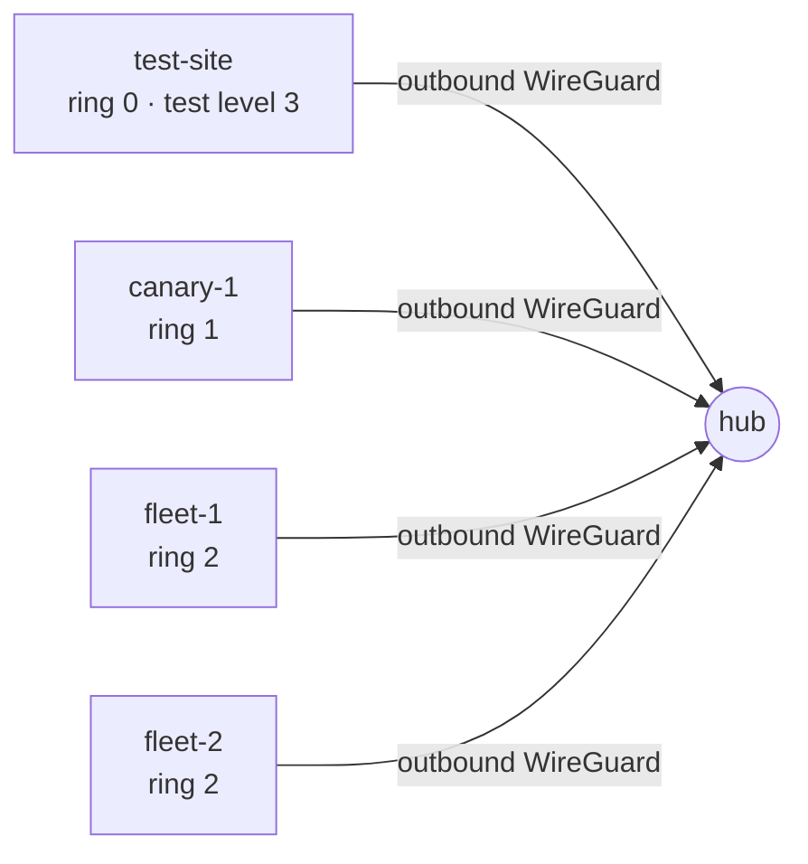

# Robot Fleet Lab

This is the companion lab for **Robot Fleet Deployment**, an article series on
[blog.bensoussan.de](https://blog.bensoussan.de/tags/robot-fleet/) about deploying
software to a fleet of edge-connected robots. Most robotics companies ship
application code competently and have no way to patch the operating system
underneath it — the machine is behind a customer's NAT, it may be mid-task, and a
failed update means someone drives to the site. The series works through a complete
deployment architecture for that problem, on two separate release paths: one that
restarts, and one that reboots. This repository is where those arguments become
something you can run instead of take on faith.

## Status: first increment boots

[06-outbound-wireguard/](06-outbound-wireguard/) is runnable: one hub, a
stand-in for the customer's router, one edge site, and the outbound-only
WireGuard tunnel between them. `vagrant up` inside that directory boots all
three, and `scripts/demo.sh` walks through the proof per machine.

Everything else — k3s on the edge servers, the two release paths, the
remaining ring sites — is still documentation only. Each article that carries
a runnable claim adds one increment, in its own directory, as it publishes.

The lint gate below runs from this first commit specifically so that everything
added afterward — starting with the first playbook — is held to a standard from its
own first line.

## Goal

Give a reader of the series a topology they can boot themselves in local VMs and
inspect, rather than a diagram they have to trust. The topology here is a scale
model of the one described in the articles: same roles, same rollout structure,
fewer machines than a real fleet.

## Target topology

- **One hub** — the central cluster. Every site's tunnel dials out to the hub; the
  hub never dials into a site. This matches the constraint that a customer's network
  is not one the operator controls or can open inbound ports on.
- **A handful of edge sites**, each a single-node k3s cluster on a VM standing in
  for one bare-metal box, each running one simulated robot workload:
  - `test-site` — ring 0, always on the newest build. It is also test level 3 (see
    [`GLOSSARY.md`](GLOSSARY.md)) — one machine, two roles.
  - `canary-1` — ring 1.
  - `fleet-1`, `fleet-2` — ring 2.
- **Outbound WireGuard only.** No site accepts inbound connections from the hub or
  from anywhere else; every tunnel is dialed from the site.
- **Two independent release paths**, planned but not yet built:
  - the app plane — Git + ArgoCD, restart only, no reboot
  - the OS plane — signed RAUC bundles to A/B slots, reboot required, gated by a
    maintenance window and a safe-to-reboot check

Every term above — `site`, `hub`, `ring`, `test site`, `test level` — is defined
precisely in [`GLOSSARY.md`](GLOSSARY.md), which is canonical for this repository
and for the article series. Read it before either one, since the series deliberately
retires an overlapping pair of terms (`deployment stage` and `tier`) that the source
material used inconsistently.

## Following along

The article series lives at
[blog.bensoussan.de/tags/robot-fleet](https://blog.bensoussan.de/tags/robot-fleet/).
Each article that ships a lab increment links to the directory in this repository
that proves its claim.

## Lint

CI runs on every push and every pull request: `shellcheck` over any shell scripts,
YAML validation, `ansible-lint` over any playbooks, and `helm template` rendering
over any charts. Nothing in the categories above exists yet, so the checks currently
pass by having nothing to fail on — they are wired up now so that the first
playbook, the first chart, and the first script are linted from the moment they
land, not retrofitted later.
